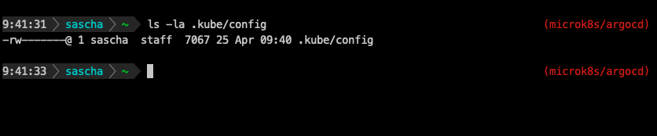

# DevOps ZSH-Theme

- Author: Sascha Mario Klein
- E-Mail: postinstall@neuroticfish.com
- GitHub: https://github.com/postinstall

## About

My humble attempt to write a zsh-theme, that displays a somewhat powerline-esque prompt that integrates git and venv. It displays the current kubernetes-context and -namespace on the right hand side.

Kudos to: https://blog.carbonfive.com/writing-zsh-themes-a-quickref/ for the inspiration.

## Requirements:

- oh-my-zsh - https://github.com/ohmyzsh/ohmyzsh
- Homebrew - https://brew.sh/index_de
- yq - https://github.com/mikefarah/yq
- Font Meslo LGS NF - https://gitee.com/romkatv/powerlevel10k/blob/master/font.md

## Install

- Clone repo and copy `devops.zsh-theme` to `~/.oh-my-zsh/custom/themes`.
- Add `ZSH_THEME="devops"` to `~/.zshrc`.
- Restart shell.

## Screenshot

